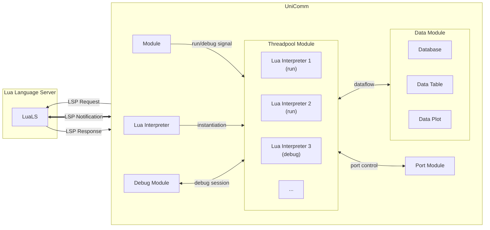
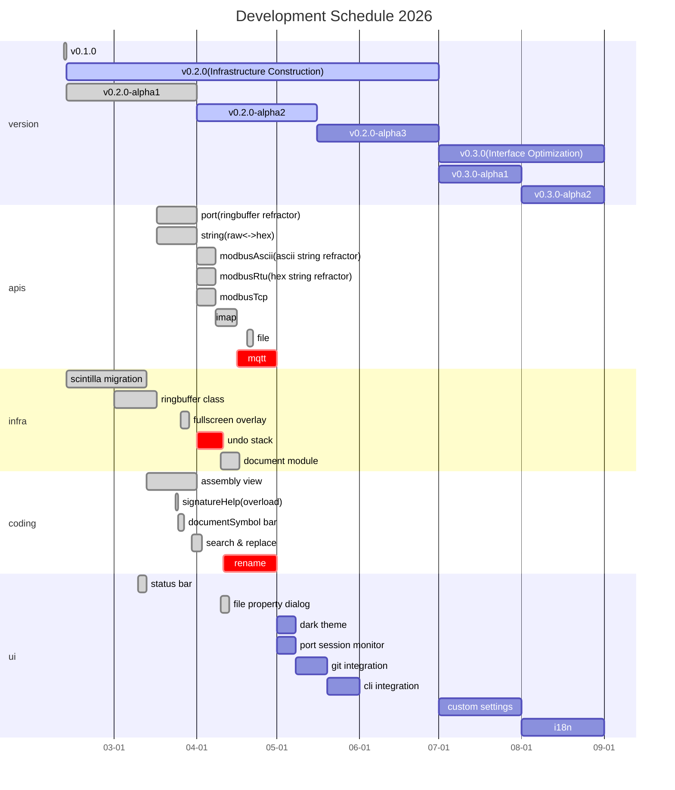
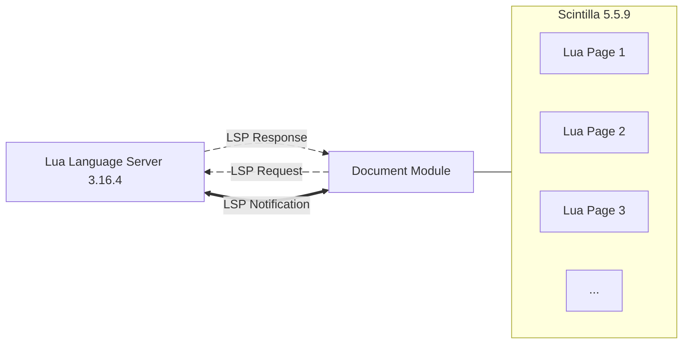

<h1 align="center">
    UniComm2
</h1>

<a href="https://github.com/zyt20001205/UniComm2" target="_blank">GitHub</a>

    A programmable communication debugging platform for multiple protocols

# APIS

## Miscellaneous

### [IO](#io-apis)

### [String](#string-apis)

### [File](#file-apis)

### [Thread](#thread-apis)

## Port Communication

### [Base](#base-apis)

### [Modbus](#modbus-apis)

### [SMTP](#smtp-apis)

### [IMAP](#imap-apis)

## Data Process

### [Database](#database-apis)

### [Datatable](#datatable-apis)

## Input Simulation

### [Mouse](#mouse-apis)

### [Key](#key-apis)

# Port Module

## Support Port Types

<table align = "center">
    <tr>
        <th colspan="4">OSI Model</th>
    </tr>
    <tr>
        <td>Application</td>
        <td align = "center">
            
        </td>
        <td align = "center">
            
             
             
             
        </td>
        <td align = "center">
            
        </td>
    </tr>
    <tr>
        <td>Presentation</td>
        <td align = "center">
            
        </td>
        <td></td>
        <td align = "center">
            
        </td>
    </tr>
    <tr>
        <td>Session</td>
        <td></td>
        <td></td>
        <td></td>
    </tr>
    <tr>
        <td>Transport</td>
        <td align = "center">
            
             
        </td>
        <td></td>
        <td></td>
    </tr>
    <tr>
        <td>Network</td>
        <td align = "center">IP</td>
        <td></td>
        <td></td>
    </tr>
    <tr>
        <td>Data Link</td>
        <td align = "center">Ethernet</td>
        <td align = "center">Serial Framing</td>
        <td></td>
    </tr>
    <tr>
        <td>Physical</td>
        <td align = "center">RJ45</td>
        <td align = "center">
            
        </td>
        <td align = "center">Screen
             Camera</td>
    </tr>
</table>

## Base APIS

|    APIS    |                             Serial Port                             |                             Tcp Client                              |                             Ssl Client                              |                             Tcp Server                              |                             Udp Socket                              |                            Video Stream                             |
|:----------:|:-------------------------------------------------------------------:|:-------------------------------------------------------------------:|:-------------------------------------------------------------------:|:-------------------------------------------------------------------:|:-------------------------------------------------------------------:|:-------------------------------------------------------------------:|
| port.open  |  |  |  |  |  |  |
| port.close |  |  |  |  |  |  |
| port.info  |  |  |  |  |  |               |
| port.read  |  |  |  |  |  |  |
| port.write |  |  |  |  |  |  |

## Modbus APIS

|                    APIS                    | Modbus Protocol                                  | ASCII                                                               | RTU                                                                 | Tcp                                                                 |
|:------------------------------------------:|:-------------------------------------------------|:--------------------------------------------------------------------|:--------------------------------------------------------------------|:--------------------------------------------------------------------|
|                                            | 01 (0x01) Read Coils                             |               |               |               |
|                                            | 02 (0x02) Read Discrete Inputs                   |               |               |               |
|   modbusAscii/Rtu/Tcp.readHoldRegisters    | 03 (0x03) Read Holding Registers                 |  |  |  |
|                                            | 04 (0x04) Read Input Registers                   |               |               |               |
|                                            | 05 (0x05) Write Single Coil                      |               |               |               |
|  modbusAscii/Rtu/Tcp.writeSingleRegister   | 06 (0x06) Write Single Register                  |  |  |  |
|                                            | 08 (0x08) Diagnostics                            |               |               |               |
|                                            | 11 (0x0B) Get Comm Event Counter                 |               |               |               |
|                                            | 15 (0x0F) Write Multiple Coils                   |               |               |               |
| modbusAscii/Rtu/Tcp.writeMultipleRegisters | 16 (0x10) Write Multiple Registers               |  |  |  |
|                                            | 17 (0x11) Report Server ID                       |               |               |               |
|                                            | 22 (0x16) Mask Write Register                    |               |               |               |
|                                            | 23 (0x17) Read/Write Multiple Registers          |               |               |               |
|                                            | 43 / 14 (0x2B / 0x0E) Read Device Identification |               |               |               |

## SMTP APIS

|      APIS      |   RFC 4954    |                               Status                                |                           
|:--------------:|:-------------:|:-------------------------------------------------------------------:|
| smtp:authLogin |  AUTH LOGIN   |  | 
|                |  AUTH PLAIN   |               | 
|                | AUTH CRAM-MD5 |               | 

|   APIS    |               RFC 5321                |                               Status                                |                           
|:---------:|:-------------------------------------:|:-------------------------------------------------------------------:|
| smtp:ehlo | Extended HELLO (EHLO) or HELLO (HELO) |  | 
|           |              MAIL (MAIL)              |               | 
|           |           RECIPIENT (RCPT)            |               |
|           |              DATA (DATA)              |               |
|           |             RESET (RSET)              |               |
|           |             VERIFY (VRFY)             |               |
|           |             EXPAND (EXPN)             |               |
|           |              HELP (HELP)              |               |
|           |              NOOP (NOOP)              |               |
| smtp:quit |              QUIT (QUIT)              |  |

|   APIS    |      UniComm       |                               Status                                |                           
|:---------:|:------------------:|:-------------------------------------------------------------------:|
| smtp:send | MAIL + RCPT + DATA |  |

## IMAP APIS

|   APIS    | RFC 2177 |                               Status                                |                           
|:---------:|:--------:|:-------------------------------------------------------------------:|
| imap:idle |   IDLE   |  |

|    APIS     |   RFC 3501   |                               Status                                |                           
|:-----------:|:------------:|:-------------------------------------------------------------------:|
|             |   STARTTLS   |               | 
|             | AUTHENTICATE |               | 
| imap:login  |    LOGIN     |  |
|             |              |                                                                     |
| imap:select |    SELECT    |  |
|             |   EXAMINE    |               |
|             |    CREATE    |               |
|             |    DELETE    |               |
|             |    RENAME    |               |
|             |  SUBSCRIBE   |               |
|             | UNSUBSCRUBE  |               |
|             |     LIST     |               |
|             |     LSUB     |               |
|             |    STATUS    |               |
|             |    APPEND    |               |
|             |              |                                                                     |
|             |    CHECK     |               |
|             |    CLOSE     |               |
|             |   EXPUNGE    |               |
|             |    SEARCH    |               |
| imap:fetch  |    FETCH     |  |
|             |    STORE     |               |
|             |     COPY     |               |
|             |     UID      |               |

|     APIS     |   UniComm    |                               Status                                |                           
|:------------:|:------------:|:-------------------------------------------------------------------:|
| imap:receive | IDLE + FETCH |  |

# Document Module

## Architecture

## Editor Features

| Feature                 | Status                                                              |
|:------------------------|:--------------------------------------------------------------------|
| comment (Ctrl+/)        |  | 
| duplicate line (Ctrl+D) |  | 
| auto pair ( [ { \" '    |  | 
| search                  |  |
| replace                 |  |

## Supported LSP Specifications

| LSP Specification               | Type         | Status                                                              |
|:--------------------------------|:-------------|:--------------------------------------------------------------------|
| textDocument/publishDiagnostics | Notification |  |
| textDocument/codeAction         | Request      |  |
| textDocument/codeLens           | Request      |               |
| textDocument/completion         | Request      |  |
| textDocument/definition         | Request      |  |
| textDocument/documentHighlight  | Request      |  |
| textDocument/documentSymbol     | Request      |  |
| textDocument/foldingRange       | Request      |  |
| textDocument/formatting         | Request      |  |
| textDocument/hover              | Request      |  |
| textDocument/implementation     | Request      |  |
| textDocument/onTypeFormatting   | Request      |  |
| textDocument/rangeFormatting    | Request      |  |
| textDocument/references         | Request      |  |
| textDocument/rename             | Request      |               |
| textDocument/semanticTokens     | Request      |  |
| textDocument/signatureHelp      | Request      |  |
| textDocument/typeDefinition     | Request      |  |

## Debug Features

| Feature                | Status                                                              |
|:-----------------------|:--------------------------------------------------------------------|
| stop                   |  | 
| resume                 |  | 
| pause                  |  | 
| step over              |  | 
| step into              |  | 
| step out               |  | 
| run to cursor          |  | 
|                        |                                                                     |
| breakpoint console     |  |
| conditional breakpoint |  |
| variable watch         |  |
| variable hot update    |  |
| callstack              |  |
| multithreading         |  |

# Data Process

## Database Module

### Database APIS

|      APIS      |                               Status                                |                           
|:--------------:|:-------------------------------------------------------------------:|
| database.list  |  | 
| database.write |  | 
| database.clear |  |

## Datatable Module

### Datatable APIS

|       APIS       |                               Status                                |                           
|:----------------:|:-------------------------------------------------------------------:|
|  datatable.list  |  | 
| datatable.write  |  | 
| datatable.clear  |  |
| datatable.export |  |

# Input Simulation

## Mouse APIS

|       APIS        |                               Status                                |                           
|:-----------------:|:-------------------------------------------------------------------:|
|    mouse.click    |  |
| mouse.doubleClick |  | 
| mouse.rightClick  |  |
|    mouse.down     |               | 
|     mouse.up      |               | 
|    mouse.drag     |               | 
|   mouse.scroll    |               | 

## Key APIS

|   APIS   |                               Status                                |                           
|:--------:|:-------------------------------------------------------------------:|
| key.tap  |  |
| key.type |  |
| key.down |               | 
|  key.up  |               |

# Miscellaneous

## IO APIS

|    APIS    |                               Status                                | Discription         |
|:----------:|:-------------------------------------------------------------------:|:--------------------|
|   io.log   |  | better then print() |
| io.message |  | messagebox          |
|  io.speak  |  | tts                 |

## String APIS

|       APIS        |                               Status                                |                           
|:-----------------:|:-------------------------------------------------------------------:|
|   string.toHex    |  |
|  string.fromHex   |  |
|  string.toBase64  |  |
| string.fromBase64 |  |

## File APIS

|  APIS   |                               Status                                |                           
|:-------:|:-------------------------------------------------------------------:|
| f.close |  |
| f.open  |  |
| f.read  |  |
| f.write |  |

## Thread APIS

|     APIS     |                               Status                                |                           
|:------------:|:-------------------------------------------------------------------:|
| thread.start |  |
| thread.stop  |  |
| thread.sleep |  |