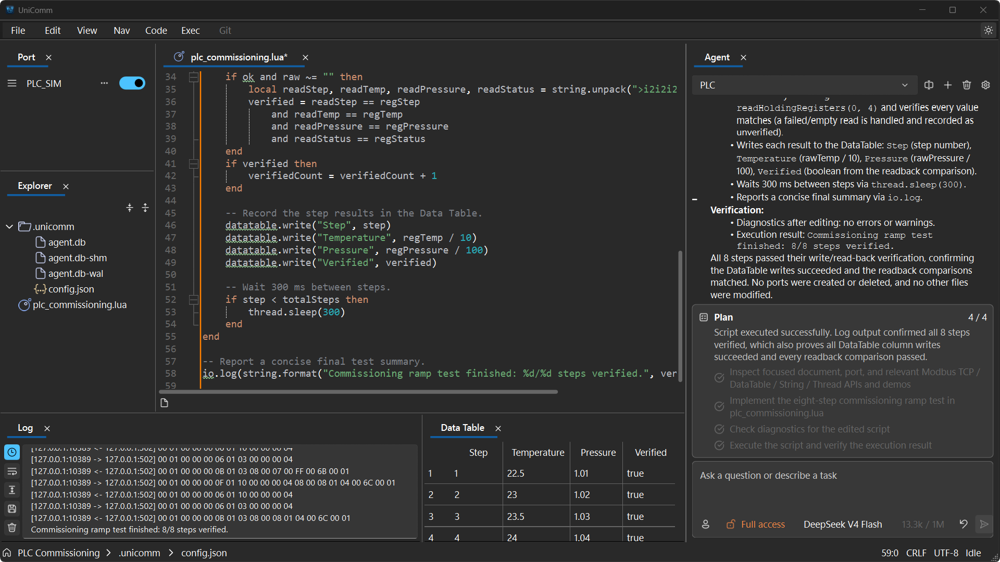
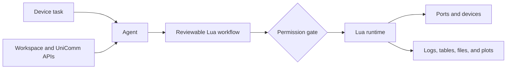

<h1>UniComm</h1>

<strong>An agent-powered workspace for device communication and automation.</strong>

Describe a device task. UniComm inspects the workspace and its APIs, builds an
auditable Lua workflow, asks before sensitive actions, runs it against configured
ports, and brings the results back into the same workspace.

<strong><a href="https://github.com/zyt20001205/UniComm/releases">Download</a></strong> |
<strong><a href="CHANGELOG.md">Changelog</a></strong> |
<strong><a href="#documentation">Documentation</a></strong>

An Agent-generated Lua workflow writes Modbus registers, verifies the readback, and records the results in one workspace.

## What is UniComm?

UniComm is a Windows desktop workspace for engineers who need to communicate
with devices, inspect data, and turn one-off debugging steps into repeatable
automation.

Its Agent goes beyond suggesting code. It can inspect the current workspace,
consult UniComm's Lua API annotations and examples, edit scripts, check
diagnostics, request approval, execute the result, and report what happened.
The generated Lua remains visible, editable, debuggable, and reusable without
the Agent.

Typical workflows include:

- Bringing up serial and network connections.
- Reading, writing, and diagnosing Modbus devices.
- Collecting device data into tables, files, and plots.
- Repairing a communication script and running it again for verification.
- Composing multi-step device and software automation in one workspace.

## How it works

| Layer           | Responsibility                                                              |
|:----------------|:----------------------------------------------------------------------------|
| Agent           | Understands the task, inspects context, and prepares the workflow.          |
| Lua workflow    | Keeps the proposed automation explicit and reviewable.                      |
| Permission gate | Leaves sensitive writes and execution under user control.                   |
| Runtime         | Executes and debugs the workflow against ports, services, and data modules. |

Simple tasks can run through a general Agent. Larger tasks can use the Team
strategy, where a supervisor coordinates hardware and software roles while the
same permission and runtime boundaries remain in place.

## Why Agent + Lua?

An Agent is useful for discovering APIs and assembling a solution, but device
automation also needs predictable execution and human control. UniComm uses Lua
as the boundary between those concerns:

- The Agent can create and revise the workflow quickly.
- The user can inspect exactly what will run.
- The runtime can execute the same workflow repeatedly without another model call.
- Existing scripts remain useful as normal source files with completion,
  diagnostics, debugging, and version control.

## Demos

| Workflow                                                                          | Result                                                                                                                                                             |
|:----------------------------------------------------------------------------------|:-------------------------------------------------------------------------------------------------------------------------------------------------------------------|
| [Modbus telemetry to FTP](https://www.bilibili.com/video/BV1Jxby6NEVr/)           | The Agent creates the required Modbus RTU and FTP ports, collects register samples in a DataTable, exports them to CSV, uploads the file, and verifies the result. |
| [ESP protocol to Bark notification](https://www.bilibili.com/video/BV1cZbQ64EYA/) | The Agent reads a custom ESP32 protocol, builds a Lua workflow that blinks and verifies the board LED, requests the Bark key, and sends a completion notification. |

## Capabilities

| Area                   | Highlights                                                                                                                                                   |
|:-----------------------|:-------------------------------------------------------------------------------------------------------------------------------------------------------------|
| Agent                  | Solo and Team strategies, planning, permission requests, user input, context persistence, workspace search and editing, API discovery, and script execution. |
| Lua runtime            | Embedded execution, language-server support, diagnostics, debugging, multiple threads, and access to UniComm modules.                                        |
| Connectivity           | Serial, TCP, UDP, SSL, WebSocket, Bluetooth LE, VISA, and video/OCR-oriented port workflows.                                                                 |
| Protocols and services | Modbus RTU/ASCII/TCP, HTTP, FTP, SMTP, IMAP, and lower-level port I/O.                                                                                       |
| Data and workspace     | Database, DataTable, plots, files, terminal sessions, Git tools, and document viewers.                                                                       |

Some transports and integrations are still experimental in the current Alpha.
See the [capability overview](docs/capabilities.md) and
[changelog](CHANGELOG.md) for more detail.

## Getting started

1. Download the latest Windows package from [Releases](https://github.com/zyt20001205/UniComm/releases).
2. Extract it to a writable directory and run `UniComm.exe`.
3. Select a workspace directory when prompted.
4. Configure an OpenAI-compatible provider from the Agent management window.
5. Configure a port or open an existing Lua workflow.

UniComm is currently distributed as portable Alpha software. Keep the extracted
runtime directories next to `UniComm.exe`.

## Documentation

- [Architecture](docs/architecture.md)
- [Capability overview](docs/capabilities.md)
- [Changelog](CHANGELOG.md)
- [Legacy technical matrix and development schedule](README_legacy.md)
- [Lua API annotations and examples](resources/meta/3rd/UniComm)

## Project status

The current line is **v0.3.0-alpha1** for Windows x64. The project is under active
development, and Alpha releases may contain incomplete or experimental features.
They should not be treated as a safety-certified control system.

## License

UniComm is licensed under the [GNU General Public License v3.0](LICENSE).
