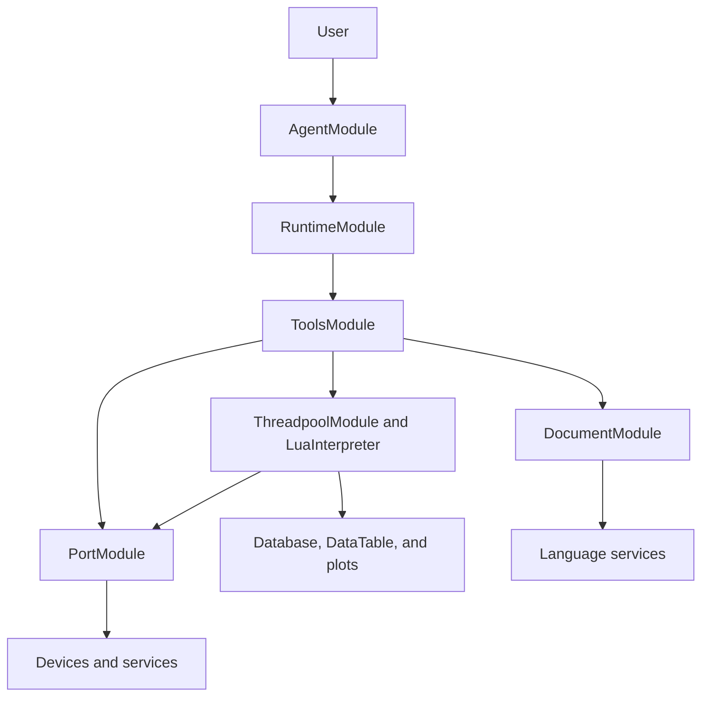

# UniComm Architecture

This document gives a technical overview of how UniComm turns a device task into
an inspectable and executable workflow. It intentionally stays above individual
class APIs; source files remain the authority for implementation details.

## System overview

The Qt Widgets and KDDockWidgets shell composes the application modules. QML is
used for module interfaces, overlays, Agent conversations, and supporting tool
windows.

## Agent execution loop

`AgentModule` owns the user-facing conversation and the active primary runtime.
`RuntimeModule` implements the execution state machine around model requests,
streaming responses, tool calls, permission requests, tool results, errors, and
cancellation.

The main loop is:

1. Build context from the current conversation, workspace, and Agent role.
2. Send a streaming request through the selected provider.
3. Collect the response and any requested tool calls.
4. Check the active access mode and request permission when required.
5. Execute approved tools and append their results to the turn.
6. Continue until the Agent returns a final response or the run is stopped.

The Solo strategy uses the general Agent directly. The Team strategy uses a
supervisor that delegates port-oriented work to a hardware role and source or
script work to a software role.

## Lua as the execution boundary

Lua workflows are normal workspace documents rather than hidden Agent state.
They can be reviewed before execution, edited manually, checked by the Lua
language server, debugged, committed to Git, and executed again without asking
the Agent to regenerate them.

`ThreadpoolModule` creates worker threads for Lua sessions. `LuaInterpreter`
loads the script and exposes UniComm APIs for ports, protocols, files, data,
input simulation, and other application services.

## Document and language services

`DocumentModule` owns open documents and routes them to the appropriate page.
Code documents use Scintilla for editing and communicate with language servers
for completion, diagnostics, navigation, formatting, symbols, and semantic
highlighting.

Agent editing tools operate through the same document layer. This keeps generated
changes visible in the editor and allows diagnostics to be checked before a
script is executed.

## Ports and devices

`PortModule` manages named transport endpoints. Lua workflows refer to a port by
name, which separates transport configuration from protocol logic. Port objects
run on dedicated threads and use ring buffers for communication-oriented reads.

Available port families include serial and network transports, WebSocket,
Bluetooth LE, VISA, and video/OCR workflows. Protocol APIs such as Modbus operate
on top of configured ports.

## Data and observability

Runtime output can be routed into logs, databases, DataTables, plots, files, and
notifications. The same workspace also includes terminal, Git, diagnostics,
debugging, and document inspection modules so that a workflow can be built,
observed, and repaired without switching applications.

## Trust boundary

UniComm keeps model output separate from execution:

- Generated Lua remains inspectable source code.
- Access modes determine which tools can run immediately.
- Sensitive edits and script execution can require explicit approval.
- Tool activity and runtime output stay visible in the conversation and workspace.

This is a human-in-the-loop engineering boundary, not a safety certification.
