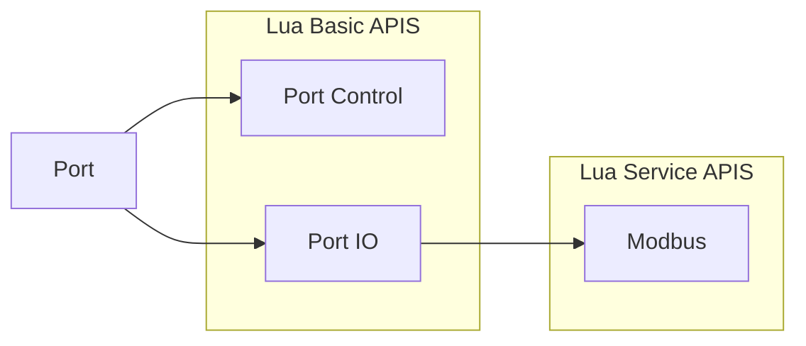
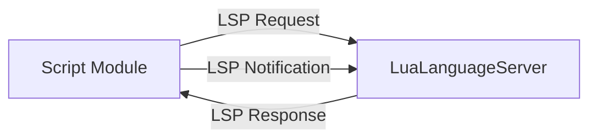

<h1 align="center">
    UniComm2
</h1>

<a href="https://github.com/zyt20001205/UniComm2" target="_blank">GitHub</a>

    A programmable communication debugging tool for multiple protocols

# Port Module

## Architecture

## Support Port Types

<table>
    <tr>
        <th colspan="4">OSI Model</th>
    </tr>
    <tr>
        <td>Application</td>
        <td colspan="2"></td>
        <td>Modbus</td>
    </tr>
    <tr>
        <td>Presentation</td>
        <td colspan="2"></td>
        <td></td>
    </tr>
    <tr>
        <td>Session</td>
        <td colspan="2"></td>
        <td></td>
    </tr>
    <tr>
        <td>Transport</td>
        <td>TCP</td>
        <td>UDP</td>
        <td></td>
    </tr>
    <tr>
        <td>Network</td>
        <td colspan="2">IP</td>
        <td></td>
    </tr>
    <tr>
        <td>Data Link</td>
        <td colspan="2">Ethernet</td>
        <td>Serial Framing</td>
    </tr>
    <tr>
        <td>Physical</td>
        <td colspan="2">RJ45</td>
        <td>Serial Port</td>
    </tr>
</table>

## Port Control APIS

|    APIS    |                             Serial Port                             |                             Tcp Client                              |                             Tcp Server                              |                             Udp Socket                              | Screen | Camera |
|:----------:|:-------------------------------------------------------------------:|:-------------------------------------------------------------------:|:-------------------------------------------------------------------:|:-------------------------------------------------------------------:|:------:|:------:|
| port.open  |  |  |  |  |        |        |
| port.close |  |  |  |  |        |        |
| port.info  |  |  |  |  |        |        |

## Port IO APIS

|      APIS      |                             Serial Port                             |                             Tcp Client                              |                             Tcp Server                              |                                       Udp Socket                                       | Screen | Camera |
|:--------------:|:-------------------------------------------------------------------:|:-------------------------------------------------------------------:|:-------------------------------------------------------------------:|:--------------------------------------------------------------------------------------:|:------:|:------:|
| port.readData  |  |  |  | (ONLY ASYNC) |        |        |
| port.writeData |  |  |  |                     |        |        |
| port.readText  |  |  |  | (ONLY ASYNC) |        |        |
| port.writeText |  |  |  |                     |        |        |

## Modbus APIS

| Function Code & Name                             | RTU Mode                                                            | ASCII Mode                                                          |
|:-------------------------------------------------|:--------------------------------------------------------------------|:--------------------------------------------------------------------|
| 01 (0x01) Read Coils                             |               |               |
| 02 (0x02) Read Discrete Inputs                   |               |               |
| 03 (0x03) Read Holding Registers                 |  |  |
| 04 (0x04) Read Input Registers                   |               |               |
| 05 (0x05) Write Single Coil                      |               |               |
| 06 (0x06) Write Single Register                  |               |               |
| 08 (0x08) Diagnostics                            |               |               |
| 11 (0x0B) Get Comm Event Counter                 |               |               |
| 15 (0x0F) Write Multiple Coils                   |               |               |
| 16 (0x10) Write Multiple Registers               |  |               |
| 17 (0x11) Report Server ID                       |               |               |
| 22 (0x16) Mask Write Register                    |               |               |
| 23 (0x17) Read/Write Multiple Registers          |               |               |
| 43 / 14 (0x2B / 0x0E) Read Device Identification |               |               |

# Script Module

## LSP Integration

| LSP Request Type            | Status                                                              |
|:----------------------------|:--------------------------------------------------------------------|
| textDocument/completion     |  |
| textDocument/foldingRange   |  |
| textDocument/formatting     |  |
| textDocument/hover          |  |
| textDocument/semanticTokens |  |
| textDocument/signatureHelp  |  |
| textDocument/definition     |               |
| textDocument/references     |               |

## Editor Features

| Feature                 | Status                                                              |
|:------------------------|:--------------------------------------------------------------------|
| comment (Ctrl+/)        |  | 
| duplicate line (Ctrl+D) |  | 
| auto pair ( [ { \" '    |  | 
| search                  |               |
| replace                 |               |
| workspace               |               |

## Debugging Features

| Feature             | Status                                                              |
|:--------------------|:--------------------------------------------------------------------|
| continue            |  | 
| pause               |  | 
| step into           |  | 
| step over           |  | 
| step out            |  | 
| variable watch      |  | 
| variable hot update |  | 
