<h1 align="center">
    UniComm2
</h1>

<div align="center">


</div>

<div align="center">

<a href="https://github.com/zyt20001205/UniComm2" target="_blank">GitHub</a>

</div>

<p align="center">
    A programmable communication debugging platform for multiple protocols
</p>

<div align="center">

[](https://github.com/zyt20001205/UniComm2/releases)
[](https://www.gnu.org/licenses/gpl-3.0)
[]()
[]()

</div>

<div align="center">

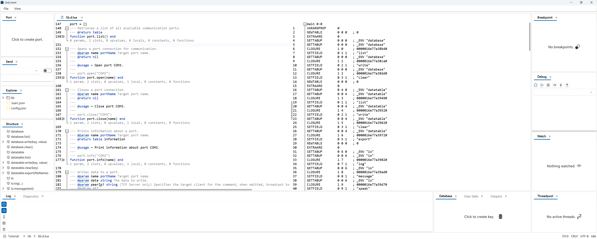

</div>

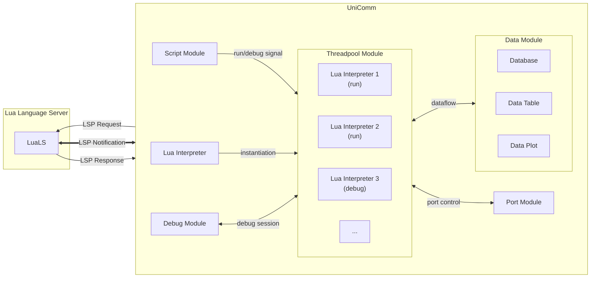

# Port Module

## Architecture

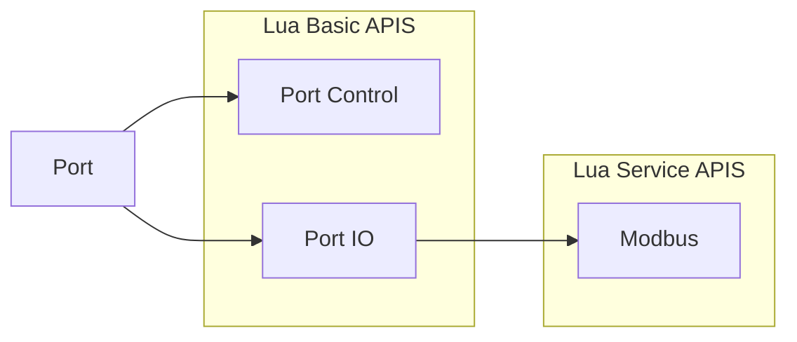

## Support Port Types

<table align = "center">
    <tr>
        <th colspan="7">OSI Model</th>
    </tr>
    <tr>
        <td>Application</td>
        <td colspan="2"></td>
        <td align = "center">Modbus</td>
        <td align = "center">USB TMC</td>
        <td align = "center" colspan="2">OCR</td>
    </tr>
    <tr>
        <td>Presentation</td>
        <td colspan="2"></td>
        <td colspan="2"></td>
        <td align = "center" colspan="2">Image Processing</td>
    </tr>
    <tr>
        <td>Session</td>
        <td colspan="2"></td>
        <td colspan="2"></td>
        <td colspan="2"></td>
    </tr>
    <tr>
        <td>Transport</td>
        <td align = "center"><a href ="#tcp">TCP</a></td>
        <td align = "center"><a href ="#udp">UDP</a></td>
        <td colspan="2"></td>
        <td colspan="2"></td>
    </tr>
    <tr>
        <td>Network</td>
        <td align = "center" colspan="2">IP</td>
        <td colspan="2"></td>
        <td colspan="2"></td>
    </tr>
    <tr>
        <td>Data Link</td>
        <td align = "center" colspan="2">Ethernet</td>
        <td align = "center" colspan="2">Serial Framing</td>
        <td colspan="2"></td>
    </tr>
    <tr>
        <td>Physical</td>
        <td align = "center" colspan="2">RJ45</td>
        <td align = "center" colspan="2"><a href ="#serial-port">Serial Port</a></td>
        <td align = "center"><a href ="#screen">Screen</a></td>
        <td align = "center"><a href ="#camera">Camera</a></td>
    </tr>
</table>

### Serial Port

| Feature      | Status                                                              |
|--------------|---------------------------------------------------------------------|
| Baud Rate    |  |
| Data Bits    |  |
| Parity       |  |
| Stop Bits    |  |
| Flow Control |               |

### TCP

| Feature              | Status                                                              |
|----------------------|---------------------------------------------------------------------|
| TCP Client           |  |
| TCP Server Unicast   |  |
| TCP Server Broadcast |  |

### UDP

| Feature    | Status                                                              |
|------------|---------------------------------------------------------------------|
| UDP Socket |  |

### Screen

| Feature          | Status                                                              |
|------------------|---------------------------------------------------------------------|
| Area Selection   |  |
| Image Processing |  |
| OCR              |  |
| DPI Adapt        |  |

### Camera

| Feature          | Status                                                              |
|------------------|---------------------------------------------------------------------|
| Area Selection   |  |
| Image Processing |  |
| OCR              |  |

## APIS

|    APIS    |                             Serial Port                             |                             Tcp Client                              |                             Tcp Server                              |                                 Udp Socket                                 |                               Screen                                |                               Camera                                |
|:----------:|:-------------------------------------------------------------------:|:-------------------------------------------------------------------:|:-------------------------------------------------------------------:|:--------------------------------------------------------------------------:|:-------------------------------------------------------------------:|:-------------------------------------------------------------------:|
| port.open  |  |  |  |         |  |  |
| port.close |  |  |  |         |  |  |
| port.info  |  |  |  |         |               |               |
| port.read  |  |  |  |  |  |  |
| port.write |  |  |  |  |         |         |

- [How is data processed in the write method?](#write-method-data-process)

- [How does timeout argument work in the read method?](#difference-between-blocking--non-blocking)

## Modbus APIS

| Function Code & Name                             | RTU Mode                                                            | ASCII Mode                                             |
|:-------------------------------------------------|:--------------------------------------------------------------------|:-------------------------------------------------------|
| 01 (0x01) Read Coils                             |               |  |
| 02 (0x02) Read Discrete Inputs                   |               |  |
| 03 (0x03) Read Holding Registers                 |  |  |
| 04 (0x04) Read Input Registers                   |               |  |
| 05 (0x05) Write Single Coil                      |               |  |
| 06 (0x06) Write Single Register                  |               |  |
| 08 (0x08) Diagnostics                            |               |  |
| 11 (0x0B) Get Comm Event Counter                 |               |  |
| 15 (0x0F) Write Multiple Coils                   |               |  |
| 16 (0x10) Write Multiple Registers               |  |  |
| 17 (0x11) Report Server ID                       |               |  |
| 22 (0x16) Mask Write Register                    |               |  |
| 23 (0x17) Read/Write Multiple Registers          |               |  |
| 43 / 14 (0x2B / 0x0E) Read Device Identification |               |  |

# Script Module

## Architecture

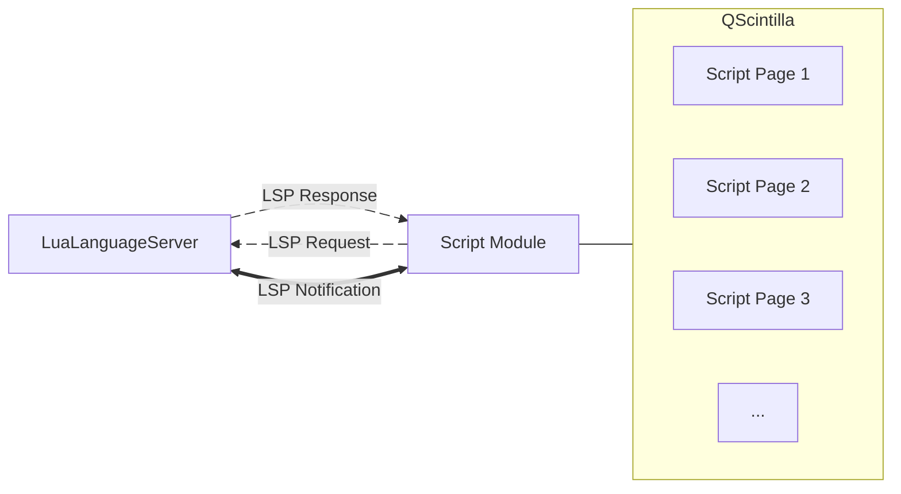

## Editor Features

| Feature                 | Status                                                              |
|:------------------------|:--------------------------------------------------------------------|
| comment (Ctrl+/)        |  | 
| duplicate line (Ctrl+D) |  | 
| auto pair ( [ { \" '    |  | 
| search                  |  |
| replace                 |  |

## Supported LSP Specifications

| LSP Specification                                                  | Type         | Status                                                                      |
|:-------------------------------------------------------------------|:-------------|:----------------------------------------------------------------------------|
| textDocument/didChange                                             | Notification |          |
| textDocument/didClose                                              | Notification |          |
| textDocument/didOpen                                               | Notification |          |
| textDocument/didSave                                               | Notification |          |
| [textDocument/publishDiagnostics](#textdocumentpublishdiagnostics) | Notification |          |
| textDocument/codeAction                                            | Request      |                       |
| textDocument/codeLens                                              | Request      |                       |
| [textDocument/completion](#textdocumentcompletion)                 | Request      |          |
| [textDocument/definition](#textdocumentgoto)                       | Request      |          |
| [textDocument/documentHighlight](#textdocumentdocumentHighlight)   | Request      |          |
| [textDocument/documentSymbol](#textdocumentdocumentsymbol)         | Request      |          |
| [textDocument/foldingRange](#textdocumentfoldingrange)             | Request      |          |
| [textDocument/formatting](#textdocumentformatting)                 | Request      |          |
| [textDocument/hover](#textdocumenthover)                           | Request      |          |
| [textDocument/implementation](#textdocumentgoto)                   | Request      |          |
| textDocument/onTypeFormatting                                      | Request      |          |
| textDocument/rangeFormatting                                       | Request      |  |
| [textDocument/references](#textdocumentgoto)                       | Request      |          |
| textDocument/rename                                                | Request      |                       |
| [textDocument/semanticTokens](#textdocumentsemantictokens)         | Request      |          |
| [textDocument/signatureHelp](#textdocumentsignaturehelp)           | Request      |          |
| [textDocument/typeDefinition](#textdocumentgoto)                   | Request      |          |

### textDocument/publishDiagnostics


### textDocument/completion


### textDocument/documentHighlight

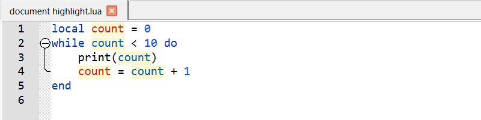

### textDocument/documentSymbol


### textDocument/foldingRange


### textDocument/formatting

Ctrl+Alt+L


### textDocument/goto


### textDocument/hover


### textDocument/semanticTokens


### textDocument/signatureHelp


## Debug Features

| Feature                                           | Status                                                              |
|:--------------------------------------------------|:--------------------------------------------------------------------|
| [stop](#stop)                                     |  | 
| [resume](#resume)                                 |  | 
| [pause](#pause)                                   |  | 
| [step over](#step-over)                           |  | 
| [step into](#step-into)                           |  | 
| [step out](#step-out)                             |  | 
| [run to cursor](#run-to-cursor)                   |  | 
|                                                   |                                                                     |
| [breakpoint console](#breakpoint-console)         |  |
| [conditional breakpoint](#conditional-breakpoint) |  |
| [variable watch](#variable-operation)             |  |
| [variable hot update](#variable-operation)        |  |
| [callstack](#callstack)                           |  |
| [heatmap](#heatmap)                               |  |
| [multithreading](#multithreading)                 |  |

### stop


### resume


### pause


### step over


### step into


### step out


### run to cursor


### breakpoint console


### conditional breakpoint


### variable operation


### callstack


### heatmap

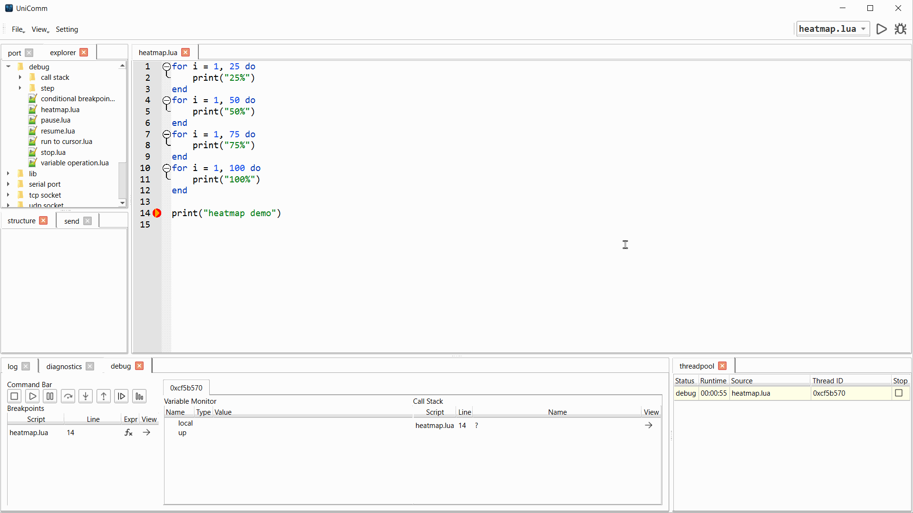

### multithreading

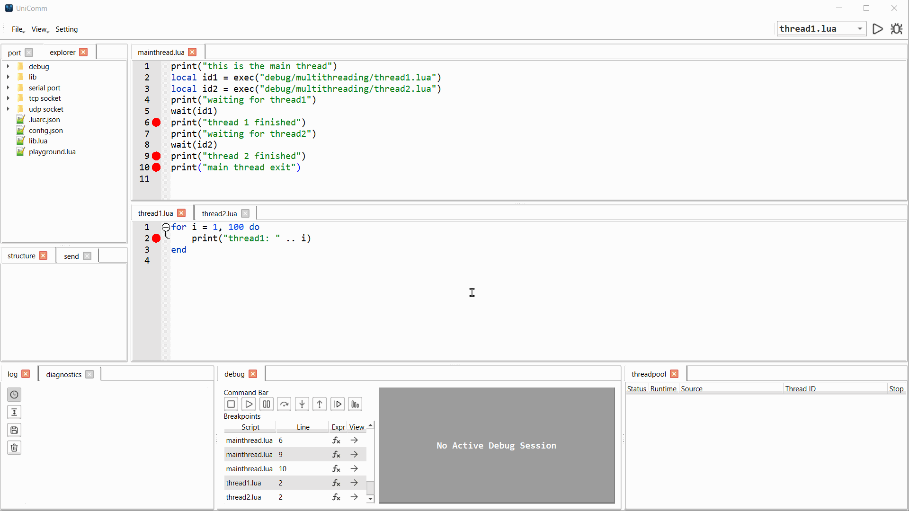

# Data Process

## Database Module

### APIS

|      APIS      |                               Status                                |                           
|:--------------:|:-------------------------------------------------------------------:|
| database.list  |  | 
| database.write |  | 
| database.clear |  |

# FAQ

## write method data process

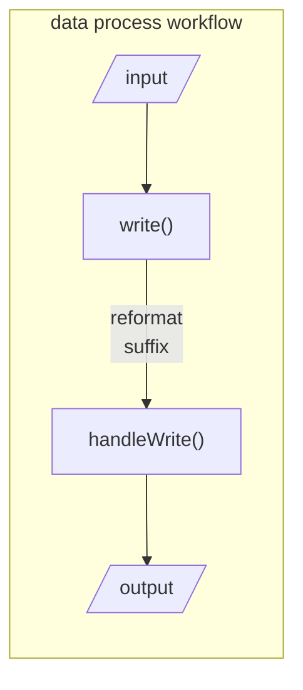

- example: hex & modbus crc

```lua
port.write("Actual Port", "0103 0000 0001")
```

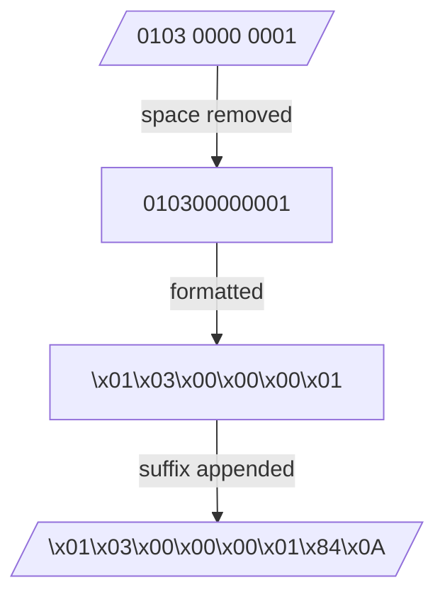

- example: ascii & crlf

```lua
port.write("Actual Port", "AT+STACH1=1")
```

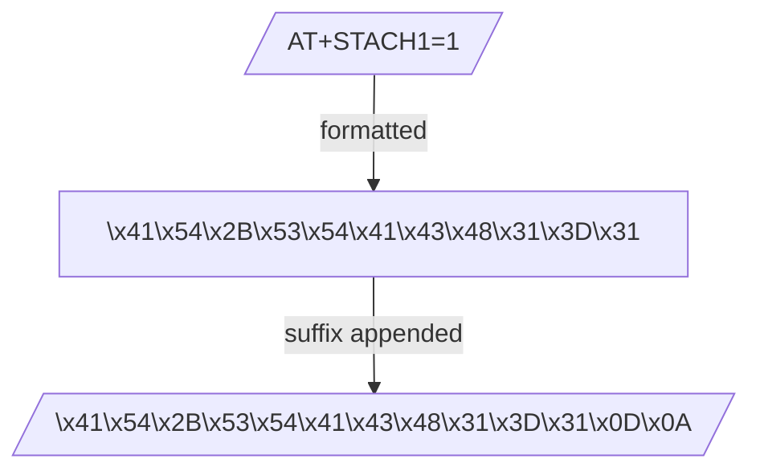

## difference between blocking & non-blocking

### blocking dataflow

```lua
port.write("Actual Port", "How are you?")
local rx = port.read("Actual Port", 1000, 6)
```

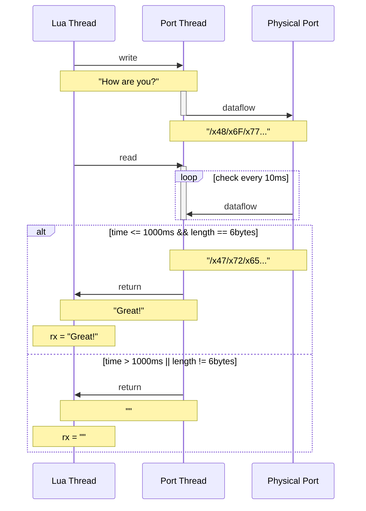

### non-blocking dataflow

```lua
port.write("Actual Port", "How are you?")
sleep(1000)
local rx = port.read("Actual Port", 0)
```

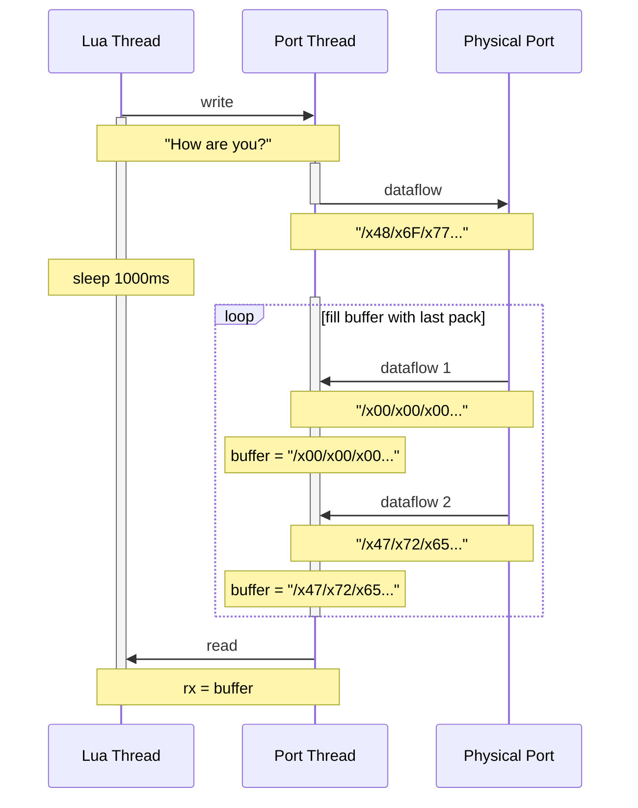