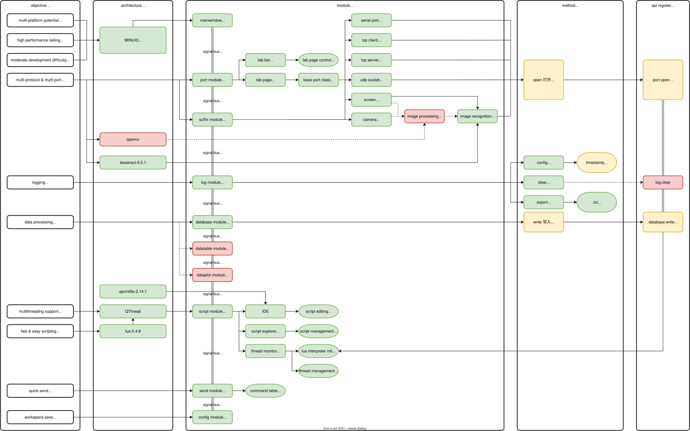

<h1 align="center">
    UniComm2
</h1>

<a href="https://github.com/zyt20001205/UniComm2" target="_blank">GitHub</a>

    A programmable communication debugging tool for multiple protocols

## Roadmap

