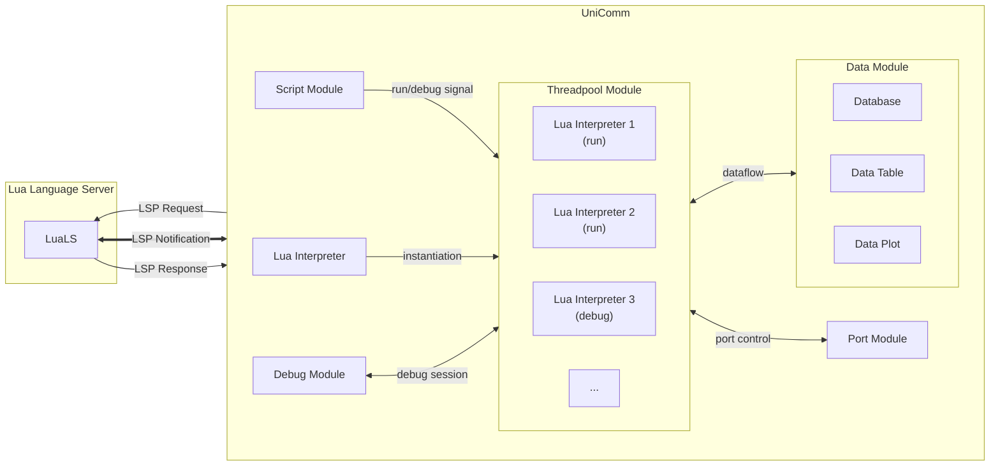
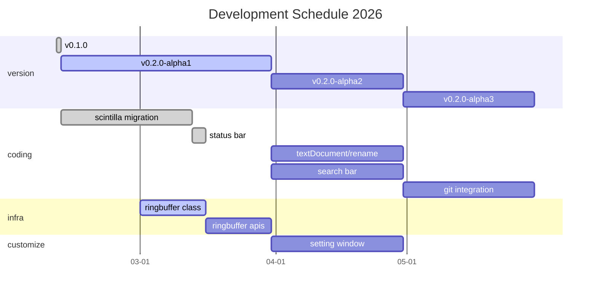

<h1 align="center">
    UniComm2
</h1>

<a href="https://github.com/zyt20001205/UniComm2" target="_blank">GitHub</a>

    A programmable communication debugging platform for multiple protocols

# APIS

## Port Communication

### [Base APIS](#base-apis)

### [Modbus APIS](#modbus-apis)

### [SMTP APIS](#smtp-apis)

## Data Process

### [Database APIS](#database-apis)

### [Datatable APIS](#datatable-apis)

# Port Module

## Support Port Types

<table align = "center">
    <tr>
        <th colspan="7">OSI Model</th>
    </tr>
    <tr>
        <td>Application</td>
        <td colspan="2"></td>
        <td align = "center">Modbus</td>
        <td align = "center">USB TMC</td>
        <td align = "center" colspan="2">OCR</td>
    </tr>
    <tr>
        <td>Presentation</td>
        <td colspan="2"></td>
        <td colspan="2"></td>
        <td align = "center" colspan="2"><a href ="#video-stream">Video Stream</a></td>
    </tr>
    <tr>
        <td>Session</td>
        <td colspan="2"></td>
        <td colspan="2"></td>
        <td colspan="2"></td>
    </tr>
    <tr>
        <td>Transport</td>
        <td align = "center"><a href ="#tcp">TCP</a></td>
        <td align = "center"><a href ="#udp">UDP</a></td>
        <td colspan="2"></td>
        <td colspan="2"></td>
    </tr>
    <tr>
        <td>Network</td>
        <td align = "center" colspan="2">IP</td>
        <td colspan="2"></td>
        <td colspan="2"></td>
    </tr>
    <tr>
        <td>Data Link</td>
        <td align = "center" colspan="2">Ethernet</td>
        <td align = "center" colspan="2">Serial Framing</td>
        <td colspan="2"></td>
    </tr>
    <tr>
        <td>Physical</td>
        <td align = "center" colspan="2">RJ45</td>
        <td align = "center" colspan="2"><a href ="#serial-port">Serial Port</a></td>
        <td align = "center">Screen</td>
        <td align = "center">Camera</td>
    </tr>
</table>

## Base APIS

|    APIS    |                             Serial Port                             |                             Tcp Client                              |                             Tcp Server                              |                                 Udp Socket                                 |                               Screen                                |                               Camera                                |
|:----------:|:-------------------------------------------------------------------:|:-------------------------------------------------------------------:|:-------------------------------------------------------------------:|:--------------------------------------------------------------------------:|:-------------------------------------------------------------------:|:-------------------------------------------------------------------:|
| port.open  |  |  |  |         |  |  |
| port.close |  |  |  |         |  |  |
| port.info  |  |  |  |         |               |               |
| port.read  |  |  |  |  |  |  |
| port.write |  |  |  |  |         |         |

## Modbus APIS

| Modbus Protocol                                  |                                  APIS                                  | RTU Mode                                                            | ASCII Mode                                                          |
|:-------------------------------------------------|:----------------------------------------------------------------------:|:--------------------------------------------------------------------|:--------------------------------------------------------------------|
| 01 (0x01) Read Coils                             |                                                                        |               |               |
| 02 (0x02) Read Discrete Inputs                   |                                                                        |               |               |
| 03 (0x03) Read Holding Registers                 |      modbusRtu.readHoldRegisters modbusAscii.readHoldRegisters      |  |  |
| 04 (0x04) Read Input Registers                   |                                                                        |               |               |
| 05 (0x05) Write Single Coil                      |                                                                        |               |               |
| 06 (0x06) Write Single Register                  |    modbusRtu.writeSingleRegister modbusAscii.writeSingleRegister    |  |  |
| 08 (0x08) Diagnostics                            |                                                                        |               |               |
| 11 (0x0B) Get Comm Event Counter                 |                                                                        |               |               |
| 15 (0x0F) Write Multiple Coils                   |                                                                        |               |               |
| 16 (0x10) Write Multiple Registers               | modbusRtu.writeMultipleRegisters modbusAscii.writeMultipleRegisters |  |  |
| 17 (0x11) Report Server ID                       |                                                                        |               |               |
| 22 (0x16) Mask Write Register                    |                                                                        |               |               |
| 23 (0x17) Read/Write Multiple Registers          |                                                                        |               |               |
| 43 / 14 (0x2B / 0x0E) Read Device Identification |                                                                        |               |               |

## SMTP APIS

|   RFC 4954    |      APIS      |                               Status                                |                           
|:-------------:|:--------------:|:-------------------------------------------------------------------:|
|  AUTH LOGIN   | smtp.authLogin |  | 
|  AUTH PLAIN   |                |               | 
| AUTH CRAM-MD5 |                |               | 

|               RFC 5321                |   APIS    |                               Status                                |                           
|:-------------------------------------:|:---------:|:-------------------------------------------------------------------:|
| Extended HELLO (EHLO) or HELLO (HELO) | smtp.ehlo |  | 
|              MAIL (MAIL)              | smtp.mail |  | 
|           RECIPIENT (RCPT)            |           |               |
|              DATA (DATA)              |           |               |
|             RESET (RSET)              |           |               |
|             VERIFY (VRFY)             |           |               |
|             EXPAND (EXPN)             |           |               |
|              HELP (HELP)              |           |               |
|              NOOP (NOOP)              |           |               |
|              QUIT (QUIT)              |           |               |

# Script Module

## Architecture

## Editor Features

| Feature                 | Status                                                              |
|:------------------------|:--------------------------------------------------------------------|
| comment (Ctrl+/)        |  | 
| duplicate line (Ctrl+D) |  | 
| auto pair ( [ { \" '    |  | 
| search                  |  |
| replace                 |  |

## Supported LSP Specifications

| LSP Specification                                                  | Type         | Status                                                              |
|:-------------------------------------------------------------------|:-------------|:--------------------------------------------------------------------|
| [textDocument/publishDiagnostics](#textdocumentpublishdiagnostics) | Notification |  |
| textDocument/codeAction                                            | Request      |  |
| textDocument/codeLens                                              | Request      |               |
| [textDocument/completion](#textdocumentcompletion)                 | Request      |  |
| [textDocument/definition](#textdocumentgoto)                       | Request      |  |
| [textDocument/documentHighlight](#textdocumentdocumentHighlight)   | Request      |  |
| [textDocument/documentSymbol](#textdocumentdocumentsymbol)         | Request      |  |
| [textDocument/foldingRange](#textdocumentfoldingrange)             | Request      |  |
| [textDocument/formatting](#textdocumentformatting)                 | Request      |  |
| [textDocument/hover](#textdocumenthover)                           | Request      |  |
| [textDocument/implementation](#textdocumentgoto)                   | Request      |  |
| textDocument/onTypeFormatting                                      | Request      |  |
| textDocument/rangeFormatting                                       | Request      |  |
| [textDocument/references](#textdocumentgoto)                       | Request      |  |
| textDocument/rename                                                | Request      |               |
| [textDocument/semanticTokens](#textdocumentsemantictokens)         | Request      |  |
| [textDocument/signatureHelp](#textdocumentsignaturehelp)           | Request      |  |
| [textDocument/typeDefinition](#textdocumentgoto)                   | Request      |  |

### textDocument/publishDiagnostics

### textDocument/completion

### textDocument/documentHighlight

### textDocument/documentSymbol

### textDocument/foldingRange

### textDocument/formatting

Ctrl+Alt+L

### textDocument/goto

### textDocument/hover

### textDocument/semanticTokens

### textDocument/signatureHelp

## Debug Features

| Feature                                           | Status                                                              |
|:--------------------------------------------------|:--------------------------------------------------------------------|
| [stop](#stop)                                     |  | 
| [resume](#resume)                                 |  | 
| [pause](#pause)                                   |  | 
| [step over](#step-over)                           |  | 
| [step into](#step-into)                           |  | 
| [step out](#step-out)                             |  | 
| [run to cursor](#run-to-cursor)                   |  | 
|                                                   |                                                                     |
| [breakpoint console](#breakpoint-console)         |  |
| [conditional breakpoint](#conditional-breakpoint) |  |
| [variable watch](#variable-operation)             |  |
| [variable hot update](#variable-operation)        |  |
| [callstack](#callstack)                           |  |
| [multithreading](#multithreading)                 |  |

### stop

### resume

### pause

### step over

### step into

### step out

### run to cursor

### breakpoint console

### conditional breakpoint

### variable operation

### callstack

### multithreading

# Data Process

## Database Module

### Database APIS

|      APIS      |                               Status                                |                           
|:--------------:|:-------------------------------------------------------------------:|
| database.list  |  | 
| database.write |  | 
| database.clear |  |

## Datatable Module

### Datatable APIS

|       APIS       |                               Status                                |                           
|:----------------:|:-------------------------------------------------------------------:|
|  datatable.list  |  | 
| datatable.write  |  | 
| datatable.clear  |  |
| datatable.export |  |